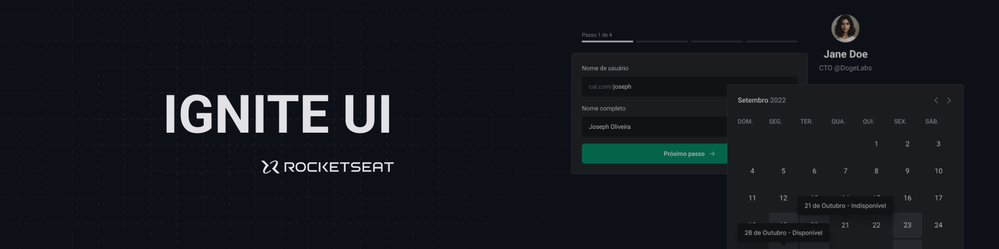
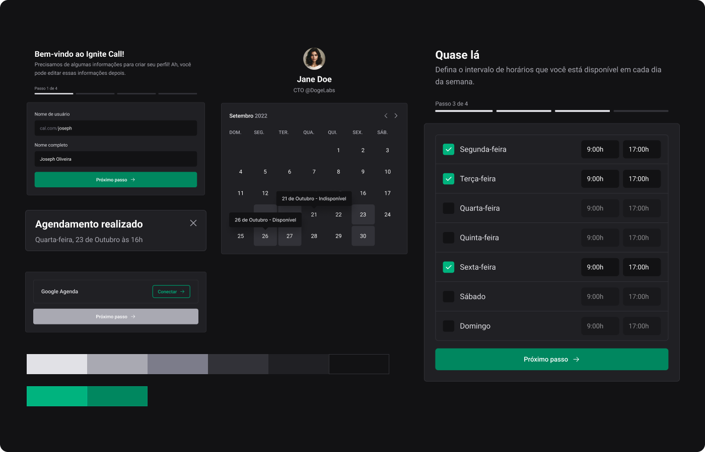

  

  
  <a aria-label="Completed" href="https://rocketseat.com.br/">
    </img>
</a>
    

## :speech_balloon: Overview

This project was built during the [Rocketseat](www.rocketseat.com.br) Ignite program and aimed to build a design system for the Ignite Call project.  
The DS was developed in a monorepo composed of token packages (colors, sizes, typography, spacing, etc...), configuration (TypeScript and ESLint), components (developed with ReacJS) and component documentation (Storybook).

## :camera: Preview

  

### Subjects

Below are some of the concepts put into practice during development:

- Creating and using monorepos
  - Using Turborepo
    - Using cache and remote caching
- Creating and reusing components
  - Documenting components with Storybook
  - CSS-in-JS with Stitches
- Publishing packages on NPM
  - Version management and CI/CD on NPM with changesets
- CI/CD with Github Actions

## :rocket: Technologies

  
  
  
  
  
  
 

 

  Made with :purple_heart:

